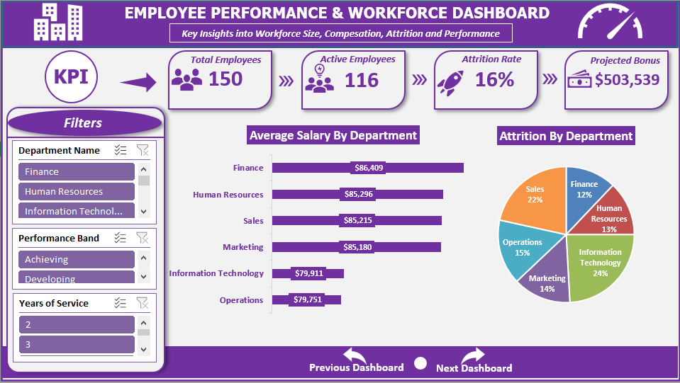

# HR Analytics Capstone Project using Microsoft Excel

# Project Overview

This project analyzes an HR dataset to uncover meaningful workforce insights using Microsoft Excel. The dataset was cleaned and transformed before being analyzed using Pivot Tables and Pivot Charts. The findings were then presented through an interactive dashboard featuring KPI Cards, charts, and slicers.

The project demonstrates the complete data analysis workflow from raw data preparation to business insights and executive reporting.

---

# Project Objectives

The primary objectives of this project are to:

- Clean and prepare HR data for accurate analysis.
- Measure workforce size and employee attrition.
- Analyze salary distribution across departments.
- Evaluate employee performance by employment status.
- Estimate projected annual bonus payouts.
- Develop an interactive HR dashboard for management reporting.

---

# Business Questions Answered

The analysis answers the following business questions:

1. What is the current workforce size?
2. Which department has the highest average salary?
3. What is the attrition rate by department?
4. How does employee performance vary by employment status?
5. What is the projected annual bonus payout by performance band?

---

# Dataset Information

| Description | Value |
|------------|------:|
| Original Records | 157 |
| Duplicate Records Removed | 7 |
| Final Records | 150 |
| Data Source | HR Employee Dataset |
| Analysis Tool | Microsoft Excel |

---

# Data Cleaning & Preparation

The raw dataset contained several quality issues that were resolved before analysis to ensure reliable results.

| Data Quality Issue | Action Taken |
|--------------------|--------------|
| Duplicate Records | Removed seven (7) duplicate employee records using Excel's **Remove Duplicates** feature, leaving 150 unique employees. |
| Missing Employee Names | Combined **First Name** and **Last Name** into a **Full Name** column using `TEXTJOIN()`. Employee ID remained the unique identifier where names were incomplete. |
| Department Code Inconsistency | Removed unnecessary spaces using `TRIM()` and standardized all department codes using `UPPER()`. |
| Hire Date Stored as Text | Converted text-based dates into valid Excel date values using formatting and **Text-to-Columns**. |
| Salary Stored as Text | Converted text values into numeric format using `VALUE()` before applying currency formatting. |
| Missing Salary Values | Replaced missing salary values using the departmental median. Where departmental data was insufficient, the overall dataset median was used. |
| Missing Performance Scores | Missing performance scores were imputed using departmental median values to preserve all employee records for analysis. |
| Employment Status Inconsistency | Corrected spelling errors (e.g., *actv* → *Active*) and standardized employment status values. |
| Years of Service | Calculated using the `DATEDIF()` function. |
| Department Name | Retrieved from a lookup table using `VLOOKUP()`. |
| Performance Band | Assigned automatically using `VLOOKUP()` against the performance lookup table. |
| Eligible Bonus | Calculated using `SALARY` together with the performance lookup table. |

---

# Excel Functions & Features Used

## Functions

- TEXTJOIN()
- TRIM()
- UPPER()
- VALUE()
- DATEDIF()
- VLOOKUP()
- IFERROR()

## Excel Features

- Excel Tables
- Pivot Tables
- Pivot Charts
- Dashboard
- Slicers
- Lookup Tables

---

# Dashboard Preview

---

# Dashboard Components

## KPI Cards

The dashboard contains the following Key Performance Indicators (KPIs):

- Total Employees
- Active Employees
- Attrition Rate
- Total Projected Bonus

---

# Key Findings

- The cleaned dataset contains **150 unique employees**.
- **116 employees are Active**, while **24 employees have Left**, resulting in an overall attrition rate of **16%**.
- **Finance** records the highest average salary.
- **Operations** experiences the highest employee attrition.
- Employees who resigned recorded the highest average performance score, suggesting that high-performing employees may also be leaving the organization.
- The projected annual bonus payout is **₦503,538.93**, with the largest allocation going to employees in the **Achieving** performance band.

---

# Business Insights

The analysis indicates that employee turnover is concentrated within specific departments rather than across the entire organization. While compensation remains relatively balanced, Operations records both the lowest average salary and the highest attrition rate, making it a key area for management attention.

Performance analysis further suggests that resignations are not limited to low performing employees, highlighting the need for stronger employee engagement and retention strategies.

---

# Strategic Recommendations

Based on the analysis, the following recommendations are proposed:

- Management should prioritize employee retention initiatives within the Operations department.
- Benchmark departmental salaries against industry standards.
- Develop targeted retention programmes for high performing employees.
- Continue implementing performance based bonus incentives.
- Monitor workforce metrics regularly through an interactive HR dashboard to support data-driven decision making.

---

# Skills Demonstrated

This project demonstrates proficiency in:

- Data Cleaning
- Data Transformation
- Data Analysis
- HR Analytics
- Excel Formulas
- Business Intelligence
- Dashboard Design
- Data Visualization
- Business Reporting
- Analytical Thinking

## AUTHOR

**Ishaq Ajayi Ismail**

Data Analyst | Excel Developer | Business Intelligence Enthusiast

Feel free to connect, collaborate, or provide feedback on this project.

---

www.linkedin.com/in/easynett | www.github.com/easynett | info2easynett@gmail.com